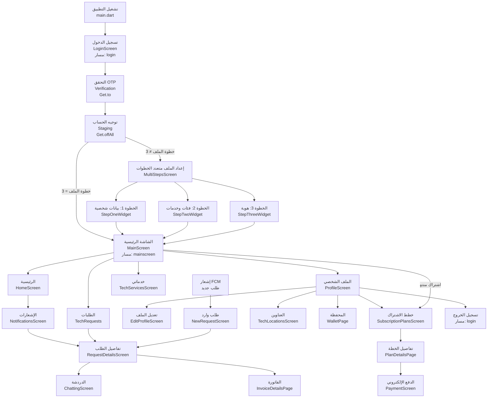

# توثيق مشروع Repairo Provider (تطبيق مزوّد الخدمة)

| البند | القيمة |
|-------|--------|
| **اسم الحزمة** | `repairo_provider` |
| **الإصدار** | `1.0.0+1` |
| **منصة التطوير** | Flutter (SDK ^3.7.2) |
| **اللغة الافتراضية للواجهة** | العربية (`ar`) مع دعم الإنجليزية |
| **عنوان API (حاليًا في الكود)** | `http://192.168.1.109:8000/api` عبر `AppConstants.baseUrl` |
| **عنوان API (إنتاج — حسب قواعد المشروع)** | `https://repairo.icu/api` |

---

## 1. نظرة عامة على المشروع وبنية النظام

### 1.1 الغرض الأساسي

**Repairo Provider** هو تطبيق جوال موجّه إلى **الفنيين / مزوّدي الخدمات** في منصة Repairo. يمكّن المستخدم (الفني) من:

- تسجيل الدخول والتحقق عبر رمز OTP.
- إكمال ملفه المهني على ثلاث مراحل (بيانات شخصية، خدمات وأسعار، وثيقة هوية).
- استقبال طلبات الخدمة من العملاء وإدارتها (قبول، رفض، تحديث الحالة).
- التواصل مع العملاء عبر دردشة فورية (REST + Pusher).
- الاشتراك في خطط مدفوعة وإدارة المحفظة والعناوين.
- متابعة إحصائيات الأداء من لوحة تحكم رئيسية.

التطبيق **لا يستهدف العميل النهائي**؛ هو الجانب «المزوّد» المكمّل لتطبيق المستخدم في المنصة.

### 1.2 البنية المعمارية (طبقات)

يتبع المشروع نمط **طبقات منفصلة** مع مزيج من **Clean Architecture المبسّط** و**Feature-oriented folders**:

```
lib/
├── core/                 # ثوابت، إعدادات، خدمات مشتركة (Firebase، Pusher، أدوات)
├── data/                 # نماذج، مستودعات (Repository)، خدمات ويب (WebService)
├── business_logic/       # Cubits و Blocs (إدارة الحالة)
├── presentation/         # شاشات وويدجتات (واجهة المستخدم)
├── app_router.dart       # مسارات مسجّلة بالاسم (Named Routes)
└── main.dart             # نقطة الدخول، Firebase، GetMaterialApp
```

| الطبقة | المسؤولية | أمثلة |
|--------|-----------|--------|
| **Presentation** | واجهات، تفاعل المستخدم، `BlocBuilder` / `BlocListener` | `login_screen.dart`, `main_screen.dart` |
| **Business Logic** | منطق العرض، حالات التحميل/النجاح/الفشل | `LoginCubit`, `TechRequestsCubit` |
| **Data** | تحويل JSON، استدعاء HTTP، إخفاء تفاصيل API | `AuthRepository`, `StatisticsWebservice` |
| **Core** | ثوابت التطبيق، Firebase، Pusher، مساعدات | `AppConstants`, `FirebaseApi`, `PusherConfig` |

### 1.3 المكدس التقني (Tech Stack)

| المكوّن | التقنية |
|---------|---------|
| إطار الواجهة | Flutter + Material |
| التنقل | **GetX** (`Get.to`, `Get.toNamed`, `Get.offAll`) + **`AppRouter.generateRoute`** |
| إدارة الحالة | **flutter_bloc** (Cubit أساسًا، Bloc للاشتراك) |
| الشبكة | **`package:http`** (غالبية الطبقة)، **Dio** موجود في `pubspec` لكنه غير مستخدم بشكل مركزي |
| التخزين المحلي | `shared_preferences` (`auth_token`, `fcm`, `is_loggedin`, `isSubscribed`) |
| الإشعارات | **Firebase Cloud Messaging** (`firebase_core`, `firebase_messaging`) |
| الوقت الفعلي | **Pusher Channels** (`pusher_channels_flutter`) للدردشة |
| الخرائط | **flutter_map** + `latlong2` لإدارة عناوين الفني |
| الخطوط | Cairo (محلي) + **Google Fonts (Cairo)** |
| التجاوب | **flutter_screenutil** |
| رسوم بيانية (معطّلة جزئيًا) | **fl_chart** (كود مخطط دائري معلّق في الرئيسية) |

### 1.4 نقطة الدخول والتوجيه

- **`main.dart`**: تهيئة Firebase، طلب صلاحيات FCM، حفظ `fcm` token، تشغيل `BreakingBadApp` (اسم مؤقت يخالف معايير المشروع).
- **`initialRoute`**: `'login'`.
- **مسارات مسجّلة فعليًا في `AppRouter`**: `login`، `mainscreen`، `MultiStepProfileScreen` فقط.
- **باقي الشاشات**: تُفتح عبر `Get.to(() => ...)` مع `BlocProvider` محلي.

---

## 2. مخطط سير العمل وخط سير المشروع

### 2.1 تدفق البيانات (من الإجراء إلى الخادم)

النمط المتكرر في الميزات المكتملة:

1. **المستخدم** ينفّذ إجراءً على شاشة (`Presentation`).
2. الشاشة تستدعي **حدثًا** على `Cubit` / `Bloc` (`business_logic`).
3. الـ Cubit يستدعي **Repository** (`data/repository`).
4. الـ Repository يستدعي **WebService** الذي يبني طلب HTTP إلى `AppConstants.baseUrl`.
5. الاستجابة تُحوَّل إلى **Model** ثم تُصدَر **State** (Loading / Success / Error).
6. الواجهة تعيد البناء عبر `BlocBuilder` أو تستمع عبر `BlocListener`.

**مثال — تسجيل الدخول:**

```
LoginScreen → LoginCubit.login(phone)
  → AuthRepository → AuthWebService (POST /technician/authentication/login)
  → حفظ auth_token في SharedPreferences
  → Get.to(Verification)
```

**مثال — طلب خدمة عبر FCM:**

```
FirebaseApi.onMessage (type: technician_accept)
  → Get.to(NewRequestScreen + UpdateRequestCubit)
  → RequestDetailsCubit.getRequestDetails
  → قبول/رفض → UpdateRequestCubit → UpdateRequestWebservice
```

### 2.2 مخطط التنقل بين الشاشات (Mermaid)



### 2.3 شرح خطوة بخطوة لمسار المستخدم الجديد

| # | الخطوة | المكوّن | ملاحظة تقنية |
|---|--------|---------|--------------|
| 1 | فتح التطبيق | `main.dart` | شاشة Splash أصلية (Android 12+) عبر `flutter_native_splash` |
| 2 | إدخال رقم الهاتف | `LoginScreen` + `LoginForm` | جلب FCM token وحفظه |
| 3 | إرسال OTP | `LoginCubit` → API | انتقال `Get.to` إلى `Verification` (المسار المسمّى `verification` **معطّل** في Router) |
| 4 | التحقق | `VerificationCubit` | عند النجاح: `Get.offAll(Staging)` |
| 5 | فحص حالة الحساب | `Staging` + `AccountStatusCubit` | `step != '3'` → onboarding؛ وإلا `MainScreen` |
| 6 | Onboarding | `MultiStepsScreen` (PageView) | ثلاث خطوات مع Cubits مخصّصة |
| 7 | الشاشة الرئيسية | `MainScreen` | `SubscriptionStatusBloc` يتحقق من `AppConstants.subscription_status` |
| 8 | استخدام الميزات | تبويبات Google Nav Bar | 4 تبويبات: رئيسية، ملف، طلبات، خدمات |

### 2.4 مخطط ASCII مبسّط للتبويب الرئيسي

```
┌─────────────────────────────────────────────────────────┐
│                    MainScreen                           │
├──────────┬──────────┬──────────────┬──────────────────┤
│ Home     │ Profile  │ TechRequests │ TechServices     │
│ إحصائيات │ إعدادات  │ قائمة/فلتر   │ عرض/تعديل خدمات │
│ إشعارات  │ اشتراك   │ → تفاصيل     │ حفظ عبر API      │
└──────────┴──────────┴──────────────┴──────────────────┘
```

---

## 3. الميزات المحققة والمفعلة بالكامل

> القائمة التالية مستخرجة من الشيفرة الفعلية (`lib/`). تُفترض الميزات «مكتملة» عند وجود مسار تنقل + Cubit/Repository + استدعاء API، ما لم يُذكر خلاف ذلك في القسم 4.

### 3.1 المصادقة والتسجيل (Auth)

| الميزة | التفاصيل |
|--------|----------|
| تسجيل الدخول بالهاتف | `LoginScreen`، `LoginCubit`، `AuthRepository`، `AuthWebService` |
| حقل هاتف دولي | `intl_phone_field` في نموذج الدخول |
| حفظ رمز الوصول | `SharedPreferences` مفتاح `auth_token` + مرآة `AppConstants.globalAccessToken` |
| التحقق برمز OTP | `Verification`، `VerificationCubit`، مؤقت إعادة الإرسال، `flutter_otp_text_field` |
| تسجيل الخروج | `ProfileScreen` → POST `/technician/authentication/logout` ثم `Get.toNamed('login')` |
| توجيه ما بعد التحقق | `Staging` يقرأ `AccountStatusCubit` ويوجّه للملف أو الرئيسية |

### 3.2 إعداد الملف المهني (Onboarding — 3 خطوات)

| الخطوة | الشاشة | Cubit | ما يُرسل |
|--------|--------|-------|----------|
| 1 | `StepOneWidget` | `StepOneCubit` | الاسم، المدينة، الجنس، الصورة، العنوان |
| 2 | `StepTwoWidget` | `StepTwoCubit` + `AllcategoriesCubit` + `SubcategoryCubit` + `ServiceCubit` | الفئات، الفئات الفرعية، الخدمات والأسعار |
| 3 | `StepThreeWidget` | `StepThreeCubit` | رفع صورة الهوية (`file_picker` / `image_picker` عبر `MainServices`) |
| حاوية | `MultiStepsScreen` | `smooth_page_indicator` | تنقل أفقي بين الخطوات |
| مسار مسجّل | `MultiStepProfileScreen` | في `AppRouter` | متاح لكن المسار الفعلي بعد OTP يستخدم `Staging` مباشرة |

### 3.3 الشاشة الرئيسية والتبويبات (Core Shell)

| الميزة | التفاصيل |
|--------|----------|
| هيكل التطبيق بعد الدخول | `MainScreen` مع `IndexedStack` و4 صفحات |
| شريط تنقل سفلي | `google_nav_bar` + `line_icons` |
| حقن Cubits للتبويبات | `ProfileCubit`, `AllstatisticsCubit`, `TechRequestsCubit`, `TechServicesCubit`, `NotifficationsCubit`, `HomeCubit`, `AllcategoriesCubit` |
| فحص الاشتراك عند الدخول | `SubscriptionStatusBloc` + حدث `CheckSubscriptionStatus` |
| حوار انتهاء الاشتراك | عند `AppConstants.subscription_status == 'inactive'` |

### 3.4 لوحة الرئيسية (Home)

| الميزة | التفاصيل |
|--------|----------|
| عرض بيانات الفني | من `ProfileCubit` / نموذج الملف |
| إحصائيات الطلبات | `AllstatisticsCubit` + `StatisticsRepository` + فلترة بالتاريخ (`fromDate` / `toDate`) |
| التعامل مع فشل الإحصائيات | `StatisticsApiException` → عرض بيانات فارغة + `warningMessage` |
| الانتقال للإشعارات | `Get.to` → `NotificationsScreen` مع `NotifficationsCubit` |
| Shimmer / تحميل | حالات تحميل في الواجهة |

### 3.5 الطلبات (Service Requests)

| الميزة | التفاصيل |
|--------|----------|
| قائمة الطلبات | `TechRequests` + `TechRequestsCubit` |
| تبويبان | طلبات نشطة (`status != 'ended'`) ومنتهية (`ended`) |
| ألوان حسب الحالة | `pending`, `accepted`, `ongoing`, `rejected`, `cancelled` |
| تفاصيل الطلب | `RequestDetailsScreen` + `RequestDetailsCubit` |
| سجل الحجز | `_buildBookingHistoryList` مع ترتيب زمني |
| تحديث حالة الطلب | `UpdateRequestCubit` (قبول، رفض، إكمال، إلخ) |
| طلب وارد من الإشعار | `NewRequestScreen` + قبول/رفض سريع |
| فتح الدردشة من التفاصيل | `Get.to` → `ChattingScreen` (ملف النسخة) |
| عرض الفاتورة | `InvoiceDetailsPage` + `InvoiceCubit` |

### 3.6 خدمات الفني (Tech Services)

| الميزة | التفاصيل |
|--------|----------|
| عرض خدمات الفني الحالية | `TechServicesScreen` + `TechServicesCubit` |
| تعديل الأسعار/الخدمات | واجهة تحرير + `_saveChanges` → API عبر `TechServicesRepository` |

### 3.7 الملف الشخصي والإعدادات (Profile)

| الميزة | التفاصيل |
|--------|----------|
| عرض الملف | `ProfileScreen` + `ProfileCubit` + `BlocBuilder` |
| صورة واسم ومكان | من `PData` / `userprofile_model` |
| تعديل الملف | `EditProfileScreen` (اسم، عنوان، صورة) |
| خطط الاشتراك | `Get.to` → `SubscriptionPlansScreen` (`subscriptions_screen.dart`) |
| إدارة العناوين | `TechLocationsScreen` + `TechLocationsCubit` + `flutter_map` |
| المحفظة | `WalletPage` يعرض الرصيد من API الملف |
| مفتاح الوضع الليلي | Switch في الواجهة (**بدون** ربط `ThemeMode` — انظر القسم 4) |

### 3.8 الاشتراكات والدفع (Subscriptions & Payments)

| الميزة | التفاصيل |
|--------|----------|
| قائمة الخطط | `SubscriptionPlansScreen` + `AllplansCubit` + `PlansRepository` |
| تفاصيل خطة | `PlanDetailsPage` + `PlanDataCubit` |
| شاشة الدفع | `PaymentScreen` (`electronic_payment_screen.dart`) — واجهة بطاقة/PayPal |
| تنفيذ الاشتراك | `SubscriptionCubit` + `SubscriptionPlanRepository` |
| العودة بعد الدفع | `Get.toNamed("mainscreen")` |
| حفظ حالة الاشتراك محليًا | `isSubscribed` في `SharedPreferences` من `Staging` |

### 3.9 الدردشة (Chat)

| الميزة | التفاصيل |
|--------|----------|
| تحميل المحادثة | `ChatCubit` → `ChatRepository` → `ChatWebservice` |
| رسائل نصية | إرسال عبر API + إضافة محلية فورية للواجهة |
| رسائل صورة | اختيار من المعرض + `sendmessage` مع ملف |
| Pusher حي | `PusherConfig.initPusher` قناة `chat.{roomId}` |
| فقاعات رسائل | `MessageBubble` مع دعم صور الشبكة وتصحيح `127.0.0.1` → `baseaddress` |

### 3.10 الإشعارات (Notifications)

| الميزة | التفاصيل |
|--------|----------|
| FCM — صلاحيات وتخزين Token | `FirebaseApi.initNotiffications` |
| FCM — خلفية | `handleBackgroundMessage` |
| FCM — فتح من إشعار | `Get.toNamed("mainscreen")` |
| FCM — طلب جديد في المقدمة | نوع `technician_accept` → `NewRequestScreen` |
| قائمة إشعارات داخل التطبيق | `NotificationsScreen` + `NotifficationsCubit` |
| تعليم كمقروء | عبر `AllNotifficationsRepository` |
| الانتقال من إشعار لطلب | `Get.to` لتفاصيل الطلب |

### 3.11 الموقع والعناوين (Locations)

| الميزة | التفاصيل |
|--------|----------|
| عرض الخريطة | `flutter_map` في `TechLocationsScreen` |
| إضافة/تعديل مواقع | `TechLocationsCubit` + `AllLocationsRepository` |
| تعيين موقع نشط | حفظ عبر API ثم `Get.offAllNamed("mainscreen")` |

### 3.12 البنية التحتية للواجهة (UI / UX)

| الميزة | التفاصيل |
|--------|----------|
| اتجاه RTL | `Directionality(textDirection: rtl)` في شاشات عربية |
| خط Cairo | محلي + Google Fonts في `ThemeData` |
| تجاوب الشاشات | `flutter_screenutil` (.w, .h, .sp) |
| أصول الصور | PNG/JPG/SVG/Lottie/GIF تحت `assets/images/` |
| أيقونة التطبيق | `flutter_launcher_icons` |
| شاشة بداية أصلية | `flutter_native_splash` (أبيض + شعار) |
| صور شبكة | `cached_network_image` |
| تحميل متحرك | Lottie في بعض الشاشات، GIF loading |
| ألوان موحّدة | `app_colors.dart`, `app_textstyles.dart` |
| معالجة أخطاء عربية | `error_handler.dart` |
| تحقق من المدخلات | `validators.dart` |

### 3.13 طبقة البيانات (Models & Repositories)

**نماذج (25+ ملفًا)** تشمل على سبيل المثال لا الحصر:

`userprofile_model`, `statistics_model`, `request_model`, `chatting_model`, `plans_model`, `invoice_model`, `notiffications_model`, `categories_model`, `tech_services_model`, `account_status_model`, وغيرها.

**مستودعات فعّالة (24 ملفًا)** مربوطة بشاشات أو Cubits، منها:

`login_repository`, `verification_repository`, `account_status_repository`, `step_one/two/three_repository`, `user_requests_repository`, `update_request_repository`, `chat_repository`, `statistics_repository`, `plans_repository`, `subscription_plan_repository`, `profile_repository`, `invoice_repository`, `notiffications_repository`, `tech_services_repository`, `all_locations_repository`, وغيرها.

**خدمات ويب (22+ ملفًا)** تغطي نقاط REST تحت `AppConstants.baseUrl`.

### 3.14 Cubits و Blocs المفعّلة

| المجموعة | الأصناف |
|----------|---------|
| Cubits | `LoginCubit`, `VerificationCubit`, `AccountStatusCubit`, `StepOne/Two/ThreeCubit`, `ProfileCubit`, `AllstatisticsCubit`, `TechRequestsCubit`, `RequestDetailsCubit`, `UpdateRequestCubit`, `ChatCubit`, `InvoiceCubit`, `AllplansCubit`, `PlanDataCubit`, `SubscriptionCubit`, `TechServicesCubit`, `TechLocationsCubit`, `NotifficationsCubit`, `AllcategoriesCubit`, `SubcategoryCubit`, `ServiceCubit`, `HomeCubit` |
| Blocs | `SubscriptionStatusBloc`, `PlansBloc`, `SubscribeBloc` (الأخيران للواجهة القديمة فقط) |

---

## 4. الميزات غير المكتملة، المعطلة، أو التي تحتوي على مشاكل

### 4.1 أعطال تنقل ومسارات (Navigation Bugs)

| المشكلة | الوصف | الموقع |
|---------|--------|--------|
| **مسار `subscription_plans` غير مسجّل** | `MainScreen` يستدعي `Navigator.pushNamed('subscription_plans')` عند انتهاء الاشتراك، بينما `AppRouter` **لا يحتوي** على `case 'subscription_plans'` → فشل تنقل محتمل | `main_screen.dart:161`, `app_router.dart` |
| **مسار `verification` معطّل** | الكود معلّق في Router؛ الاعتماد على `Get.to` فقط | `app_router.dart` |
| **مسار `notifications` معطّل** | كان مسجّلًا سابقًا ومعلّق الآن | `app_router.dart` |
| **ازدواجية مسار Onboarding** | `MultiStepProfileScreen` مسجّل لكن بعد OTP يُستخدم `Staging` وليس `Get.toNamed` | `verification.dart`, `staging.dart` |
| **استيراد ملف بمسافة مشفّرة** | `import '...chatting_screen%20copy.dart'` هش أثناء إعادة التسمية | `request_details.dart` |

### 4.2 شاشات وملفات «شبح» أو legacy

| العنصر | الحالة |
|--------|--------|
| `chatting_screen.dart` | **المحتوى بالكامل معلّق** — غير usable |
| `chatting_screen copy.dart` | الشاشة **الفعلية** للدردشة — يخالف قاعدة «لا ملفات copy» |
| `subscription_plans_screen.dart` | واجهة قديمة (`PlansBloc` / `SubscribeBloc`) — **لا يُستورد** من أي مكان |
| `BreakingBadApp` | اسم جذر التطبيق placeholder | `main.dart` |
| ~450 سطر في `app_router.dart` | router قديم **معلّق بالكامل** في أعلى الملف |
| ~170 سطر في `main.dart` | تطبيق Pusher تجريبي **معلّق** |

### 4.3 ميزات واجهة غير موصولة (UI Shell Only)

| الميزة | المشكلة |
|--------|---------|
| **المدفوعات** | `onTap: () {}` فارغ في `ProfileScreen` |
| **الوضع الليلي** | `Switch` يغيّر `isDarkMode` محليًا فقط دون `Get.changeTheme` أو `ThemeMode` |
| **سياسة الخصوصية / الشروط / الدعم / طرق الدفع** | عناصر قائمة **بدون** `onTap` أو `url_launcher` |
| **مخطط دائري للإحصائيات** | كود `fl_chart` **معلّق** في `home_screen.dart` |
| **تبويب البحث / الخريطة في Main** | مذكور في تعليقات — غير مفعّل |

### 4.4 طبقة بيانات وخدمات معطّلة أو يتيمة

| المكوّن | الحالة |
|---------|--------|
| `HomeRepository` | جميع الدوال **معلّقة** (بحث، بانرات) |
| `HomeCubit` | مزروع في `MainScreen` لكن بدون منطق فعّال من Repository |
| `PrevWorksCubit` + `PreviousWorksRepository` | **لا شاشة** تستخدمها |
| `NotificationService` (`flutter_local_notifications`) | الملف **معلّق بالكامل**؛ الحزمة **معلّقة** في `pubspec.yaml` |
| `LocalStorageService` | **معلّق بالكامل** |
| `NetworkCheckingService` (`connectivity_plus`) | **معلّق بالكامل** |
| `home_nav.dart` | متصفح متداخل للرئيسية — **معلّق** |
| `AppConfig.init()` | **لا يُستدعى** من `main.dart` — بيئات dev/staging/prod غير مفعّلة |
| `audioplayers` و `record` | في `pubspec` — **لا استخدام** في `lib/` (دردشة صوتية غير مبنية) |

### 4.5 أمن وإعدادات بيئة

| المشكلة | التفاصيل |
|---------|----------|
| **عنوان API محلي** | `192.168.1.109:8000` — لن يعمل خارج شبكة التطوير |
| **مفاتيح Pusher مضمّنة** | `APP_ID`, `API_KEY`, `SECRET` في `pusher_config.dart` |
| **مفاتيح placeholder** | `googleMapsApiKey`, `firebaseServerKey` = `YOUR_*` |
| **مصادقة قنوات Pusher الخاصة** | `authEndpoint` و `onAuthorizer` **معلّقان** — قد تفشل قنوات private |
| **تسريب أسرار في Git** | خطر عالي إذا رُفعت القيم الحقيقية |

### 4.6 انتهاكات معمارية ومشاكل جودة

| المشكلة | التفاصيل |
|---------|----------|
| **HTTP في Presentation** | `edit_profile.dart`, `profile.dart` (logout), `notiffications_screen.dart` تستدعي `http` مباشرة |
| **تكرار اسم `SubscriptionPlansScreen`** | في `subscriptions_screen.dart` و `subscription_plans_screen.dart` |
| **تكرار `StepTwoRepository`** | ملفان repository بنفس اسم الصنف |
| **تسجيل مزدوج لـ FCM background** | `initNotiffications` و `initPushNotiffications` |
| **معالج foreground لـ FCM** | `onMessageOpenedApp.listen` **داخل** `onMessage.listen` — سلوك غير موثوق |
| **استخدام `print` بدل `debugPrint`** | منتشر في عدة شاشات |
| **TODO صريح** | `subscriptions_screen.dart`: `// TODO: implement initState` |
| **موقع GPS في MainScreen** | كتلة `location` package **معلّقة** بالكامل |
| **اعتماد حوار الاشتراك على متغير عام** | `AppConstants.subscription_status` قد لا يتزامن مع API فورًا |

### 4.7 ميزات تعمل جزئيًا أو بحذر

| الميزة | القيد |
|--------|-------|
| الدردشة | تعمل من ملف `copy`؛ بدون إشعارات محلية عند رسالة جديدة في المقدمة |
| إشعار FCM عند الضغط | يوجّه دائمًا إلى `mainscreen` دون تمرير `service_request_id` في `handleMessage` |
| الدفع الإلكتروني | واجهة جاهزة؛ يعتمد على نجاح API الخلفية ولا يوجد تكامل واضح مع بوابة حقيقية في العميل |
| الإحصائيات | عند الخطأ تُعرض قيم فارغة — قد يظن المستخدم أنها صفر حقيقي |
| صورة الملف الافتراضية | مسار `default_profile.png` قد يكون غير موجود في الأصول |

---

## 5. نصائح إصلاحية ومفاهيمية

### 5.1 إصلاحات عاجلة (أولوية عالية)

1. **تسجيل مسار `subscription_plans` في `AppRouter`**  
   اتبع النمط الموثّق في قواعد المشروع (`flutter-navigation.mdc`): `MultiBlocProvider` مع `AllplansCubit` و `SubscriptionCubit` و `SubscriptionPlansScreen` من `subscriptions_screen.dart`.  
   أو استبدل `pushNamed` بـ `Get.to` كما في `ProfileScreen` لتوحيد الأسلوب.

2. **دمج شاشة الدردشة**  
   - انقل محتوى `chatting_screen copy.dart` إلى `chatting_screen.dart`.  
   - احذف ملف النسخة.  
   - حدّث الاستيراد في `request_details.dart`.

3. **توحيد عنوان API**  
   - فعّل `AppConfig.init()` في `main()` مع `--dart-define=ENV=prod`.  
   - اجعل `AppConstants.baseUrl` يقرأ من `AppConfig` فقط.  
   - لا تُبقِ IP محليًا في الفرع الرئيسي.

4. **إخراج الأسرار من الشيفرة**  
   - Pusher و Firebase عبر `--dart-define` أو ملفات غير متتبعة موثّقة في README.  
   - أضف `.env` إلى `.gitignore` إن لزم.

5. **إصلاح `FirebaseApi`**  
   - افصل `onMessage` (عرض إشعار محلي أو Snackbar) عن `onMessageOpenedApp`.  
   - مرّر `service_request_id` في `handleMessage` للانتقال المباشر لتفاصيل الطلب.

### 5.2 تحسين المعمارية (متوسط المدى)

| المحور | التوصية |
|--------|----------|
| **إدارة الحالة** | الإبقاء على Cubit للميزات الجديدة؛ دمج `PlansBloc`/`SubscribeBloc` في Cubits أو حذف الملفات اليتيمة |
| **حقن التبعيات** | مقدّم Service Locator بسيط (`get_it`) أو مصنع Router يبني Repository مرة واحدة — يقلل تكرار `BlocProvider(create: (_) => ...)` |
| **طبقة الشبكة** | طبقة `ApiClient` واحدة (Dio موحّد) مع Interceptors للـ Token والـ Timeout بدل تشتت `http` |
| **Presentation نظيفة** | منع `import package:http` من الشاشات؛ نقل logout وتعديل الملف إلى `ProfileCubit` / `EditProfileCubit` |
| **التنقل** | مسارات مسجّلة للتدفقات المتكررة (`verification`, `subscription_plans`, `notifications`)؛ `Get.to` فقط عند تمرير معاملات معقّدة |
| **معالجة الأخطاء** | استخدام `ErrorHandler` و `Either<Failure, T>` أو sealed classes للنتائج بدل `emit` بنص خام |

### 5.3 ميزات معطّلة — خطة تفعيل

| الميزة | خطوات مقترحة |
|--------|--------------|
| إشعارات محلية | إلغاء تعليق `flutter_local_notifications` في `pubspec`، تفعيل `NotificationService`، استدعاؤها من `FirebaseMessaging.onMessage` |
| أعمال سابقة (Portfolio) | شاشة `PrevWorksScreen` + ربط `PrevWorksCubit` + عنصر في الملف الشخصي |
| مخطط الإحصائيات | إعادة تفعيل `fl_chart` مع بيانات `RStatisticsData` الحقيقية |
| فحص الاتصال | تفعيل `NetworkCheckingService` وعرض Banner عند انقطاع الشبكة |
| الدردشة الصوتية | إن رُغب: طبقة Media في `ChatCubit` باستخدام `record` + `audioplayers` الموجودين مسبقًا |
| المدفوعات / الشروط | ربط `url_launcher` بصفحات ويب ثابتة أو WebView داخل التطبيق |

### 5.4 منع تكرار المشاكل (Best Practices)

```text
┌──────────────┐     ┌──────────────┐     ┌──────────────┐     ┌──────────────┐
│   Screen     │ ──► │    Cubit     │ ──► │  Repository  │ ──► │  WebService  │
│  (UI فقط)    │     │  (منطق UI)   │     │  (عقد API)   │     │  (HTTP خام)  │
└──────────────┘     └──────────────┘     └──────────────┘     └──────────────┘
        │                                                              │
        └──────────────── Router واحد + AppConfig للبيئة ─────────────┘
```

- **قاعدة واحدة للمسارات**: أي `pushNamed` يجب أن يكون له `case` في `AppRouter` — راجعها في CI بسكربت بسيط (`grep pushNamed` مقابل `case '`).
- **لا ملفات `copy`**: استخدم Git للفروع بدل نسخ الشاشات.
- **حذف الكود الميت**: الكتل المعلّقة الطويلة في `main.dart` و `app_router.dart` تُربك المراجعين — انقل التاريخ إلى Git.
- **اختبارات حرجة**: على الأقل اختبارات وحدة لـ `LoginCubit`, `AccountStatusCubit`, `StatisticsRepository` مع mock HTTP.
- **توثيق API**: ملحق في هذا الملف أو Swagger من الخلفية يوضح حالات `subscription_status` و `step`.

### 5.5 إعادة تسمية وتوحيد العلامة التجارية

- استبدال `BreakingBadApp` بـ `RepairoProviderApp` (مذكور في قواعد المشروع).
- توحيد تسمية الملفات الإنجليزية (`notiffications` → `notifications`) تدريجيًا مع refactor آمن للـ imports.

---

## ملحق أ — هيكل المجلدات المرجعي

```
lib/
├── app_router.dart
├── main.dart
├── core/
│   ├── config/          (app_config, pusher_config)
│   ├── constants/       (app_constants, colors, strings)
│   ├── services/        (firebase_api, main_services, …)
│   └── utils/
├── data/
│   ├── models/
│   ├── repository/
│   └── web_services/
├── business_logic/      (Cubit & Bloc لكل ميزة)
└── presentation/
    ├── screens/         (25 ملف شاشة)
    └── widgets/
```

## ملحق ب — مسارات API النسبية (أمثلة شائعة)

> المسارات الفعلية تُستنتج من WebServices؛ قد تختلف حسب إصدار الخادم.

| المجال | مسار نموذجي |
|--------|-------------|
| تسجيل الدخول | `/technician/authentication/login` |
| تسجيل الخروج | `/technician/authentication/logout` |
| الإحصائيات | عبر `StatisticsWebservice` |
| الطلبات | عبر `TechRequestsWebservices` / `UpdateRequestWebservice` |
| الدردشة | عبر `ChatWebservice` |
| الخطط | عبر `PlansWebservice` / `SubscriptionPlanWebservice` |

---

*آخر تحديث للتوثيق: مايو 2026 — مبني على تحليل شيفرة المشروع `repairo_provider`.*
